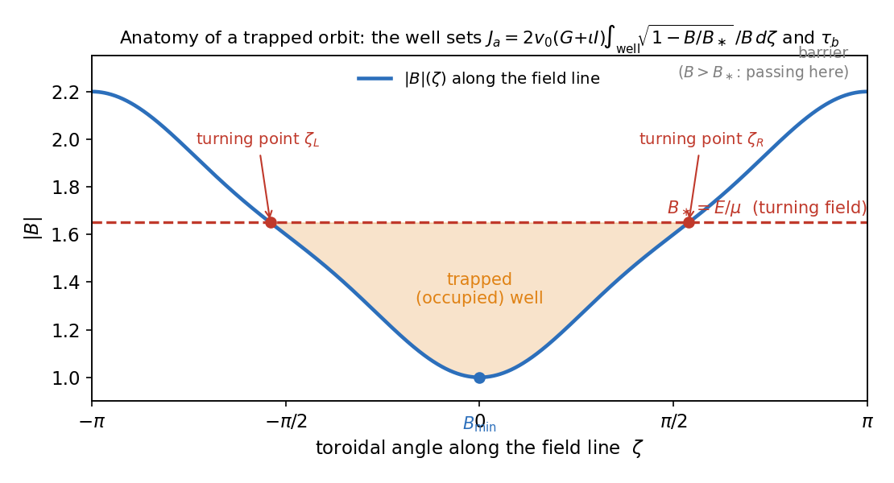
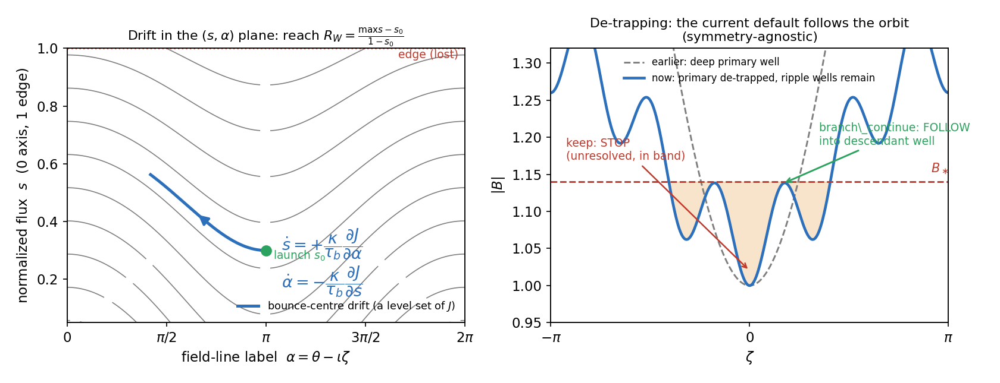
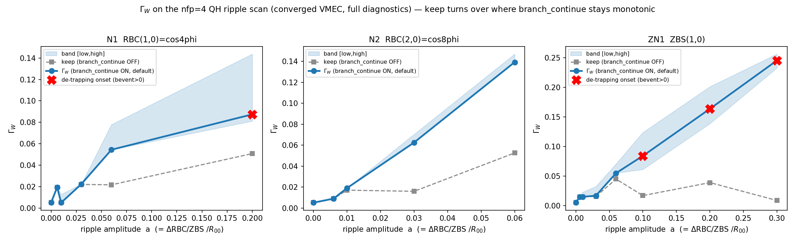

# Γ_W — the Whitham Energetic-Particle Confinement Proxy

**A standalone, physicist-oriented reference** · Documentation revision **2026-07-13**
Canonical engine: `Gamma_W_final.py`, md5 **`b58272e4`**

> **One-paragraph summary.** Γ_W is a fast, **field-only** proxy for prompt energetic-particle
> (fusion-alpha) confinement in stellarators and tokamaks. A trapped alpha's **bounce centre** —
> its guiding centre averaged over one bounce — drifts slowly across flux surfaces; Γ_W measures
> **how far, radially, that drift can carry the trapped population before a chosen time `t*`**,
> using only the equilibrium magnetic field, with no collisional orbit tracing. It rests on
> Whitham / bounce-averaged adiabatic theory: the second adiabatic invariant `J` is conserved
> along the drift, so the bounce centre moves along level sets of `J(s,α)` and its radial speed is
> set by `∂J/∂α`. Γ_W is the **source-averaged normalized radial reach** of that motion:
> `Γ_W = 0` means the trapped source stays put (well confined); `Γ_W = 1` means the whole source
> reaches the edge.

This document defines every term, gives the full mathematical formulation and numerics, describes
the code and its diagnostics, and records the validation history and the honest scope of the
metric. It is the current (July-13) revision of the July-1 `DOCUMENTATION.md`, updated for the
`gamma_c` sibling, the code-integrity patches, and the test suite. A LaTeX/PDF version with the
same content ships alongside (`Gamma_W_doc.tex` / `.pdf`).

---

## 1. The physical picture

A fusion alpha is born at 3.52 MeV, far faster than the bulk plasma, and slows down over ~0.1–0.2 s.
If it is **trapped** in a magnetic well it bounces back and forth along a field line; averaged over
that fast bounce, its guiding centre (the "bounce centre") drifts slowly from one flux surface to
the next. In a perfectly quasisymmetric field this radial drift vanishes and trapped alphas stay
confined; any residual symmetry breaking makes the bounce centre walk radially, and if it reaches
the edge the alpha is lost before it can heat the plasma. Γ_W quantifies exactly this radial walk,
from the field alone.

### 1.1 Boozer coordinates

The equilibrium is read in **Boozer coordinates** `(s, θ, ζ)`:

- **`s`** — normalized toroidal flux, the **radial** coordinate: `s = 0` is the magnetic axis,
  `s = 1` the last closed flux surface (LCFS / plasma edge), `s = ψ/ψ_LCFS`. (`ρ = √s` is the
  normalized minor radius; `s0 = 0.3` is `ρ ≈ 0.55`, mid-radius.)
- **`θ`** — Boozer poloidal angle (the short way around); **`ζ`** — Boozer toroidal angle (the long
  way around).
- **`|B|(s,θ,ζ)`** — field strength. In Boozer coordinates the field-line geometry collapses onto
  the flux functions `G(s)`, `I(s)` (poloidal / toroidal current functions) and `ι(s)` (rotational
  transform), so the parallel dynamics reduce to a **one-dimensional problem along the field line**.

### 1.2 Field line, trapping, and the well

- **`ι(s)` (rotational transform)** — poloidal turns per toroidal turn. A field line on surface `s`
  is the curve `θ = α + ι(s)·ζ`.
- **`α = θ − ι(s)·ζ` (field-line label)** — labels *which* field line. Together `(s, α)` pick a
  specific line; Γ_W's drift lives in this `(s, α)` plane at fixed energy `E` and magnetic moment `μ`.
- **Trapped vs. passing.** A particle with parallel velocity `v∥ = v0·√(1 − B/B*)` is **trapped**
  where `B < B*` (it turns around where `B = B*`) and **passing** if it circulates without `v∥`
  vanishing. Γ_W acts on the trapped population; passing markers get reach `R_W = 0` and their
  fraction is reported.
- **`B* = E/μ` (turning / mirror field)** — the `|B|` at which a given particle turns. Numerically
  `B* = B_launch / (1 − ξ²)` with `ξ = v∥/v` the launch **pitch**, computed from the field's *own*
  `|B|` so it never depends on stored units.
- **The well / occupied branch.** At fixed `(s, α, B*)` the set `{ζ : B(ζ) < B*}` is a union of
  intervals — the magnetic wells the particle could occupy. It sits in one specific well (its
  **occupied branch**), seeded from its launch `ζ0` by *continuity* — not the global minimum, which
  would cause spurious jumps between depth-degenerate wells.



**Figure 1 — Anatomy of a trapped orbit.** `|B|` along a field line. The particle with turning
field `B* = E/μ` is trapped in the shaded well between the turning points `ζ_L, ζ_R` (where
`B = B*`). The well fixes the bounce integrals `J_a` and `τ_b`. The turning points and well shown
are computed by the actual engine (`find_wells`/`integrate_well`).

---

## 2. Definition of Γ_W

### 2.1 Bounce integrals

For the occupied well of a trapped alpha (`v0 = √(2E/mα)` its speed, Boozer arc length
`dℓ = |G + ιI|/B · dζ`), the physical full-bounce second adiabatic invariant and bounce time are

```
   Second adiabatic invariant  (physical FULL bounce):
       J_a(s,α)  = 2 v0 (G + ιI) ∫_well √(1 − B/B*) / B   dζ         [m²/s]

   Bounce time:
       τ_b(s,α)  = (2/v0)(G + ιI) ∫_well 1 / (B √(1 − B/B*)) dζ      [s]
```

- **`J`** (equivalently `J∥ = ∮ v∥ dℓ`) is the **second adiabatic invariant**, conserved when the
  field varies slowly over a bounce — the whole method rests on `J` being an invariant of the drift.
- **`τ_b`** is the bounce period; the `1/√(1−B/B*)` factor diverges **integrably** at the turning
  points and is integrated analytically per grid cell (§5).

### 2.2 The bounce-centre drift (Whitham characteristic)

The bounce centre drifts along level sets of `J` at fixed `(E, μ)`. The signed, time-parametrized
characteristic is

```
   ṡ   = + κ (1/τ_b) ∂J/∂α          (radial drift)
   α̇   = − κ (1/τ_b) ∂J/∂s          (field-line precession)
   κ   = sign_conv · mα / (Zα e Ψ_LCFS)      (drift normalization)
```

`κ` fixes the absolute drift rate: `mα, Zα e` are the alpha mass and charge and
`Ψ_LCFS = |ψ0| = Φ_edge/2π` is the edge toroidal flux over 2π (the Boozer canonical-momentum
normalization). **This is taken from the field's definition, not fitted**; `sign_conv = +1` was
fixed once by the Landreman gate (§8) and never changed.

**Why `∂J/∂α` is radial drift:** this is the bounce-averaged grad-B / curvature drift in
action–angle form, exactly analogous to `ẋ = ∂H/∂p`. A field in which `J` does *not* depend on `α`
(an **omnigeneous** / perfectly quasisymmetric field) has `ṡ = 0`: no radial drift, perfect trapped
confinement. **Γ_W therefore measures the residual `α`-dependence of `J` that quasisymmetry breaking
introduces.**

### 2.3 Per-marker reach and the configuration objective

Integrating the ODE for each launched particle ("marker") `i` to endpoint `t*`:

```
   R_{W,i}(t*) = clip[ (max_{0≤t≤t*} s_i(t) − s0,i) / (1 − s0,i) , 0, 1 ]

   Γ_W(t*)     = Σ_i w_i R_{W,i} / Σ_i w_i          ← PRIMARY objective
   L_W(t*)     = Σ_i w_i · 1[s_max,i ≥ 1] / Σ_i w_i ← diagnostic (too binary to headline)
```

`R_W` is the normalized radial reach of one marker (`0` = stays at launch surface, `1` = reaches the
edge). **Γ_W** is the source-averaged reach over all markers, with `w_i` the source quadrature
weight of an isotropic, volume-uniform source on `s0` — a single scalar per configuration. `L_W`
(weight that hit the edge) is kept only as a diagnostic, because a binary reached/didn't-reach throws
away the graded reach that makes Γ_W robust. **`t*`** is the only geometry-dependent knob: the
physical time over which one asks "how far can it drift" — e.g. a slowing-down time (0.2 s) or a
prompt-loss window (10 ms). Γ_W is a **prompt-excursion** metric (see §10).



**Figure 2.** *Left:* the bounce centre drifts along a level set of `J` in the `(s, α)` plane; the
radial reach `R_W` is its furthest excursion toward the edge, normalized by `1 − s0`. *Right:* a
de-trapping event — the occupied (primary) well has become too shallow to hold the particle while
ripple/secondary wells remain. The published "keep" metric **stops** (marks the marker unresolved,
in the band); the current default `branch_continue` **follows** the orbit into the descendant well
and lets its own drift decide the fate (§3).

---

## 3. De-trapping and the branch-continued Whitham

The adiabatic picture assumes the particle stays in *one* well for the whole time. Real trapped
orbits can **de-trap**: as the bounce centre drifts, its occupied well can become too shallow and
vanish (`B*` rises above the local `B_min`) or split. What happens next decides confinement and is
the crux of the current version.

In a **quasisymmetric stellarator** de-trapping usually means the orbit becomes passing or re-traps
in an equivalent well and stays confined. In a **tokamak with toroidal-field ripple** (or a
symmetry-broken region) de-trapping can drop the particle into a **ripple well**, whose vertical
grad-B drift does *not* bounce-average to zero, so the particle walks radially out and is lost. A
naive metric that simply stops at the de-trapping event gets this backwards and produces spurious
**non-monotonic dips** in Γ_W vs. ripple.

Three treatments are available on `GWParams`:

1. **`branch_continue=True` — default, recommended.** The symmetry-agnostic branch-continued
   Whitham. At a de-trapping event the code does not guess — it **follows** the orbit into the
   descendant (ripple/secondary) well (found by maximum-interval overlap, stepped with clipped Euler
   because RK4 re-blows-up the fragile ripple-well finite differences) and lets that well's own
   bounce-averaged radial drift decide lost vs. confined. With no descendant well the orbit is
   `DETRAP_PASSING` (de-trapped to passing → confined). Using no symmetry assumption, it works
   uniformly on quasi-axisymmetric (QA), quasi-helical (QH), axisymmetric, *and* mixed-symmetry
   fields. `branch_continue=False` recovers the exact original "keep" metric bit-for-bit.

2. **`detrap_fate=True` — superseded (kept for reference).** The older `δ_QS` classifier calls a
   de-trapped orbit lost if the local quasisymmetry-breaking `δ_QS` (the `|B|` variation along the
   QS-invariant helix) exceeds a threshold `η_ripple`. It needs a *dominant* helicity, so it is
   meaningless on mixed symmetry and over-corrected some QA cases; replaced by `branch_continue`.

3. **`branch_continue=False` (keep).** Stops at the de-trapping event and keeps the reach so far.
   Under-counts loss where de-trapping leads to ripple-trapping, producing the non-monotonic dips.

**Validated behaviour.** `branch_continue` is byte-identical to the published keep metric on the
good QA/QH/mixed legacy sets — it is *inert* where orbits stay adiabatically confined. The direct
same-engine comparison (identical markers, `branch_continue` the only difference) gives rank
agreement **0.9999–1.0000** on all three legacy datasets: it fires in proportion to de-trapping
(4/250 configs on Alex, both QA configs on Paul, 2645 continuation hops on the mixed-symmetry
Landreman cfg4) and still does not change the ordering.

On a *rippled* field, where de-trapping drives the transport, a branch-aware treatment is what
removes the spurious dip; Figure 3 shows this qualitatively on the QH ripple scan. The quantified
statement supported by a frozen artifact is the de-trapping **fate** treatment on the rippled
tokamak: Spearman-vs-loss rises from **0.05** (keep) to **0.93** at `n=2`, and from **0.58** to
**0.96** at `n=3` (`gamma_w_n{2,3}_fate.csv`, η=0.02; robust over η ∈ [0.01, 0.03]). Option 2 is
superseded as a general default because δ_QS needs a dominant helicity — but this is the one
geometry where it is well posed: for a tokamak/QA (N=0) the QS-invariant direction *is* the
toroidal direction, so δ_QS reduces exactly to the raw ripple. A
branch-continued equivalent of those two numbers has **not** been re-frozen on the current engine
and is deliberately not quoted here. See §8.

---

## 4. Outputs, band, and regime flags

`gamma_w_for_boozmn(...)` returns a dictionary and (verbose) prints, e.g.

```
  nfp=4 Psi_LCFS=6.6628  N=128 t*=0.2s s0=0.3  branch_continue=True fate=False
  Gamma_W = 0.00516   L_W = 0.0000   [adiabatic-resolved]
  band [low,high] = [0.00516, 0.00516]
  passing_frac = 0.648  unresolved = 0.000  branch_event = 0.000
```

| field | meaning |
|---|---|
| **`Gamma_W`** | the headline reach (the "keep" aggregation of resolved reaches). |
| **`L_W`** | loss-fraction proxy (weight with `s_max ≥ 1`); diagnostic only. |
| **`Gamma_W_low` / `_high`** | the **uncertainty band**: score every *unresolved* marker's reach as `0` (low, pessimistic) or `1` (high, optimistic). The truth for a de-trapped orbit lies in the band; when de-trapping → ripple-trapping → loss the **high** edge is correct. Report the band, not just the point. |
| **`regime`** | a plain-language trust flag (below). |
| **`passing_frac`** | source weight passing at birth (`R_W = 0`); if `> 0.85` the trapped-only Γ_W is blind to most of the source. |
| **`branch_event_w_frac`** | source weight that hit an *unresolved* de-trapping/branch event. |
| **`unresolved_w_frac`** | source weight whose characteristic could not be cleanly resolved (any event/guard status). **Never** silently converted to a loss. |
| **`n_cont_rescues`** | (per marker) total branch-continuation rescues, *including* those fired inside an RK4 substage; `≥ n_branch`. See §9. |

**Regime flag** (the "read-me" for the number):

- **`adiabatic-resolved`** (`bevent ≤ 0.20`, `passing ≤ 0.85`) — `Gamma_W` (keep) is trustworthy;
  the band is tight.
- **`de-trapping-dominated`** (`bevent > 0.20`) — many orbits de-trap; the point estimate is
  under-resolved → **read the `[low,high]` band** and prefer `branch_continue`.
- **`passing-dominated`** (`passing > 0.85`) — most of the source is passing; a trapped-only reach
  metric is blind here.

**Per-marker status codes.** `ok_confined`, `ok_lost` (reached edge), `detrap_passing`
(branch-continued to passing → confined), `ripple_lost` (`δ_QS` fate: ripple-trapped → lost),
`passing` (passing at birth), and the *unresolved* set `branch_event_unresolved`,
`tau_guard_unresolved`, `fd_branch_mismatch_unresolved`, `step_cap_unresolved`,
`field_eval_failed`, `no_launch`. Only `ok_lost`/`ripple_lost` contribute to `L_W`; **all** statuses
keep their verified `s_max → R_W`. A numerical failure is **never** mapped to a physical outcome (§9).

---

## 5. Numerical method (why it is trustworthy)

- **Turning-point-aware bounce quadrature (the verifiable core).** The integrands carry an
  integrable `1/√(1−B/B*)` singularity at the turning points. Rather than a numerical floor, the
  code takes `g ≡ 1 − B/B*` **linear across each grid cell** and integrates `√g` and `1/√g`
  **analytically** per cell (prefactor cell-averaged). Validated against `scipy.quad` to ~1e-5 on
  parabolic and cosine model wells across depths `q* = 0.05–0.8`
  (`python Gamma_W_final.py --selftest`).
- **Predictive single-shot ODE stepping.** The step is set so both `|Δs| < ds_step_max` (0.02) and
  `|Δα| < dalpha_step_max` (0.03) in one shot — **no** adaptive retries in the singular de-trapping
  regions (retries re-trigger the blow-up). If the required step falls below a floor the marker is
  flagged `step_cap_unresolved` rather than crawling.
- **Branch-event guard ladder.** Before `ṡ` can blow up near a vanishing well, guards fire:
  descendant-well overlap/continuity; well too shallow (`B* − B_min < η_B(B_max − B_min)`,
  `η_B = 1e-4`); trapped width `< 4·Δζ_grid`; `τ_b` non-finite or `< η_τ·median` (`η_τ = 1e-3`);
  finite-difference branch mismatch. Each event stops and keeps the verified reach; unresolved
  fractions are reported, never silently turned into losses.
- **Closed-orbit / stall early exits.** Bounded (confined) orbits are detected by first-peak /
  no-radial-progress tests so they do not crawl for thousands of steps. This is a prompt-reach
  approximation, justified because a monotone escaper cannot be truncated and a librating orbit's
  first excursion bounds its reach.

---

## 6. The Nemov Γ_c sibling

`gamma_c.py` computes Nemov's contour-inclination proxy Γ_c as a **read-only by-product** of the
same pipeline. Per trapped marker at its launch,

```
   γ_c = (2/π) · atan2( |∂J/∂α| , |∂J/∂s| )   ∈ [0,1]
```

with the derivatives taken from Γ_W's own `_rhs` at `t = 0` (no ODE, no branch continuation), so
they are bit-identical to the Γ_W drift by construction — the common `τ_b/κ` factor cancels inside
`atan2`. It aggregates as the weighted mean of `γ_c²` over trapped markers (`Γ_c_trapped`) or over
the full source (`Γ_c_source`). Γ_c is a launch-point (one-shot) statistic by construction; the
comparison against the path-integrated Γ_W is the scientific point. On Alex-250, `Γ_c_trapped`
Spearman-vs-loss = 0.446, below Γ_W (0.656) and QS (0.736) — consistent with Γ_W's radial-reach
integration adding skill over the launch-point angle.

---

## 7. Using the code

### 7.1 Command line

```bash
# a process with firm3d (NOT simsopt in the same process -- a pybind11 clash):
source /opt/miniconda3/etc/profile.d/conda.sh && conda activate simsopt

python Gamma_W_final.py --selftest                   # quadrature self-test (no firm3d)
python Gamma_W_final.py --boozmn FILE.nc             # score one equilibrium (branch_continue ON)
python Gamma_W_final.py --boozmn FILE.nc --keep      # disable branch_continue (exact keep metric)
python Gamma_W_final.py --boozmn FILE.nc --N 256 --t-star 0.2 --s0 0.3 --seed 7
```

`FILE.nc` is a VMEC `wout` **or** a `booz_xform` `boozmn` file (built with `flux=True`). `--keep`
recovers the published pre-`branch_continue` numbers exactly.

### 7.2 Python

```python
from Gamma_W_final import gamma_w_for_boozmn

agg = gamma_w_for_boozmn(
        "wout.nc",
        N=128,          # isotropic, volume-uniform markers on s0
        t_star=0.2,     # endpoint [s]
        s0=0.3,         # launch surface
        seed=7,
        branch_continue=True)   # DEFAULT symmetry-agnostic de-trapping treatment
# agg['Gamma_W'], agg['Gamma_W_low'/'_high'], agg['regime'],
# agg['branch_event_w_frac'], agg['passing_frac'], agg['L_W'], ...
```

**Key objects.** `FieldBundle` wraps a firm3d `InterpolatedBoozerField` (exposes `modB`,
`profiles`→`(G,I,ι)`, `Psi_LCFS`, `nfp`, `helicity`, and an `s`-clamp guarding an out-of-domain
firm3d segfault). `GWParams` is the parameter dataclass (quadrature resolution, finite-difference
steps, ODE stepping, guard thresholds, de-trapping switches). `make_surface_markers` is the
isotropic source; `integrate_characteristic` is the signed Whitham ODE with the guard ladder;
`aggregate` turns per-marker rows into Γ_W, the band, the regime flag, and the fractions.

**Environment.** firm3d must be imported in a process that does *not* import `simsopt` (pybind11
clash); VMEC (to *make* equilibria) uses simsopt, so generation and scoring run in separate
processes.

---

## 8. Validation history and the converged verdict

| dataset | what | result |
|---|---|---|
| Quadrature self-test | `J, τ_b` vs. `scipy.quad` | rel. err ≤ 4e-5 ✅ |
| **Landreman gate** (mixed nfp=4, vs. FIRM3D) | normalization + mechanism | Γ_W: cfg5_prompt **0.701** > cfg5_confined 0.394 > cfg4_control **0.076**; ṡ_W/FIRM3D O(1) from definitions |
| **Paul** (5 reactor configs) | rank loss | mechanism right; per-config reach under-predicts trapped QA banana loss (boundary result) |
| **Alex** (250 QH perturbations) | rank loss | amplitude trend near-perfect (σ-bin-median 0.985); Spearman 0.656 < QS 0.736 |
| **Rippled tokamak** (n=2, n=3) | resolve the de-trapping dip | keep Spearman 0.05 → de-trapping **fate 0.93** (n=2); 0.58 → **0.96** (n=3), η=0.02; base axisymmetric case stays exactly 0 |
| **keep vs `branch_continue`** | does the de-trapping treatment change rankings? | rank agreement **0.9999–1.0000** on Alex-250 / Paul / Landreman — active but rank-preserving |
| **QH toroidal ripple** | behaviour on QH + ripple | Figure 3 |



**Figure 3 — QH toroidal-ripple test.** Where de-trapping onsets, the raw *keep* metric turns over
non-monotonically (the "dip") while the branch-continued Γ_W stays monotonic in ripple amplitude,
with the `[low,high]` band bracketing it. The dip is the `branch_continue=OFF` signature; the band +
regime flag are the recommended read for a ripple scan.

**Converged verdict (unchanged).** Γ_W's leading-order **adiabatic reach** captures the loss
**mechanism** (Landreman gate) and the **amplitude scaling** (Alex σ-bin-median 0.985), but is
*not* a drop-in quantitative replacement for the quasisymmetry error QS: on the full Alex-250 it
trails QS (0.656 vs. 0.736), and on Paul it under-predicts trapped-channel QA banana loss. The
missing ingredient is the finite-orbit-width / non-adiabatic drift that a field-only proxy omits by
construction. **Γ_W is best used as a mechanism / amplitude / ripple diagnostic, not a predictive
surrogate for QS.** No fitted multipliers or dataset-specific coefficients enter: the only
geometry-dependent knob is `t*`.

---

## 9. Code integrity, provenance, and tests

The canonical engine is the single file `Gamma_W_final.py`. Its identity is pinned by md5; the
lineage of the current release is

```
   9de057ad  →  5952f45f  →  575187cf  →  b58272e4   (the file shipped here)
```

Two July-13 patches produced this lineage; both are score-preserving on the published "keep" metric
and are covered by regression tests.

- **P1 / status propagation (`9de057ad → 5952f45f`).** Previously a *numerical* finite-difference
  mismatch (a valid well but a failed drift stencil) could fall through to the ODE substepper and,
  under `branch_continue`, be mis-scored `DETRAP_PASSING` (physically confined, outside the band).
  Now any non-"ok" status stops the marker, preserves `s_max`, and is flagged **unresolved** with
  its originating status; only a genuinely empty descendant well yields `DETRAP_PASSING`. A
  numerical failure is never mapped to a physical outcome. keep-mode Γ_W is numerically unchanged.
- **`n_cont_rescues` counter (`5952f45f → 575187cf`).** Diagnostic-only. The internal `n_branch`
  counter misses continuation rescues that fire inside an RK4 substage; `n_cont_rescues` is a
  persistent tally of *every* rescue and satisfies `n_cont_rescues ≥ n_branch`. It is never read by
  control flow, so all scores (keep and branch-continue) are byte-identical.

**Test suite.** A `pytest` suite (in `tests/`) locks the engine: a fast pure-numpy `unit` tier
(turning-point quadrature vs. `scipy.quad`, well detection, the `B*/κ` normalizations, occupied-well
action, the aggregation band/regime logic, the `γ_c` angle, and the control-ladder decisions via
mocked field evaluations — including the keep-vs-branch-continue dispatch and the two patches
above), plus a firm3d-dependent `regression`/`slow` tier that scores a small shipped QA `boozmn`
against frozen values. Run `pytest -m unit` for the <1 s firm3d-free lane.

**Ripple-scan generator (`scripts/create_scan.py`).** The tool that adds boundary ripple for the
ripple-scan gate had two boundary-corruption bugs (an exponent-strip parse bug and a `reset()`
list-aliasing bug that accumulated ripple across scan iterations); both are fixed and locked by
`tests/test_create_scan.py` (a zero-perturbation-identity + non-accumulation regression test). Scan
*equilibria* must be regenerated with the fixed generator before any ripple-scan number is cited.

---

## 10. Scope and limitations

- Γ_W is a **prompt-excursion** metric. Full-interval integration to a slowing-down time
  (`t* = 0.2 s`) is both intractable (~10⁴–10⁵ steps/marker) and outside the validity of a
  collisionless adiabatic model over a slowing-down time; the metric is therefore defined and used
  as a prompt radial-reach quantity.
- It is **field-only and adiabatic**: it omits the finite-orbit-width / non-adiabatic drift, so it
  captures loss *mechanism* and *amplitude scaling* but is not a quantitative surrogate for QS.
- It is a **trapped-population** metric: passing fraction is reported, and a `passing-dominated`
  configuration (>85% passing) is flagged as one where a trapped-only reach is blind.
- On a ripple scan the source-averaged reach is intrinsically **bumpy** (a threshold quantity:
  markers cross the edge non-monotonically), independent of de-trapping — fit a trend and read the
  band, do not over-read individual points.

---

## 11. Package contents and reproduction

```
Gamma_W_standalone/
  Gamma_W_doc.{tex,pdf,md}         <- this document (three formats)
  Gamma_W_final.py                 <- canonical engine (md5 b58272e4)
  gamma_c.py                       <- Nemov Gamma_c sibling (read-only by-product)
  README.md                        <- quickstart + manifest
  scripts/
    create_scan.py                 <- ripple-scan boundary generator (P5-fixed)
    make_doc_figures.py            <- regenerates figures/anatomy + drift_and_detrapping
  figures/
    anatomy_of_a_well.png          <- Fig 1 (engine-generated)
    drift_and_detrapping.png       <- Fig 2 (engine-generated)
    qh_ripple_diagnostic.png       <- Fig 3 (QH-ripple validation)
  pyproject.toml                   <- pytest markers (unit/regression/slow)
  tests/
    conftest.py  test_core.py  test_dynamics.py  test_gamma_c.py  test_regression.py
                                   <- pytest suite (unit + regression) + test_files/ QA boozmn
    test_create_scan.py            <- ripple-generator regression test
```

**Reproduce a self-test and a single score (run from the package root):**

```bash
conda activate simsopt
python Gamma_W_final.py --selftest
python Gamma_W_final.py --boozmn <wout_or_boozmn>.nc --N 128 --t-star 0.2 --s0 0.3
pytest -m unit          # <1 s, no firm3d (43 tests); `pytest` adds the firm3d regression tier
```

---

*The only geometry-dependent knob is the physical endpoint `t*`. `branch_continue=True` is the
default; `--keep` recovers the published keep-metric exactly.*
